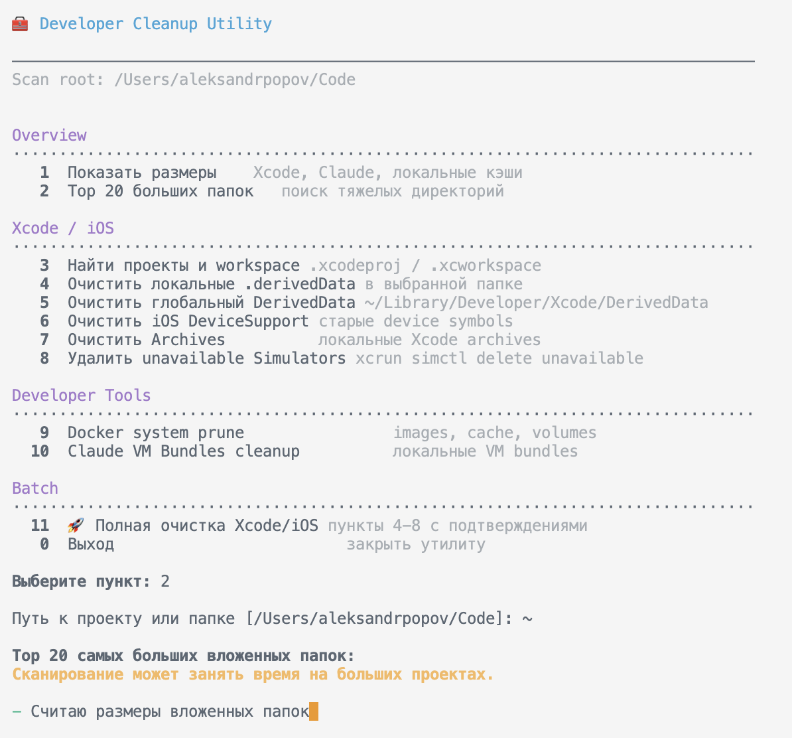

# Developer Cleanup Utility

[Русская версия](README.ru.md)

`dev-cleanup.sh` is an interactive cleanup utility for developer machines. It helps inspect disk usage and clean common local caches for Xcode/iOS, Docker, and Claude without assuming that projects live in one fixed directory.

## Screenshots



## Features

- Structured terminal menu with sections for overview, Xcode/iOS, developer tools, and batch cleanup.
- Configurable scan root for project search and local cache discovery.
- Xcode project and workspace discovery for `.xcodeproj` and `.xcworkspace` bundles.
- Disk usage reports for Xcode DerivedData, iOS DeviceSupport, Archives, Claude VM bundles, and local `.derivedData` folders.
- Top 20 folder analysis for investigating large project directories.
- Spinners, progress bars, confirmations, and status output for long-running operations.
- Docker cleanup via `docker system prune -a --volumes`.

## Installation

Make the script executable:

```bash
chmod +x dev-cleanup.sh
```

Optional: install it into your home directory:

```bash
install -m 755 dev-cleanup.sh ~/dev-cleanup.sh
```

## Usage

Run:

```bash
~/dev-cleanup.sh
```

Or from the repository:

```bash
./dev-cleanup.sh
```

By default, the utility uses `~/Code` as the scan root if that directory exists. Otherwise, it falls back to `~`.

You can override the default scan root:

```bash
DEFAULT_SCAN_ROOT=~/Projects ./dev-cleanup.sh
```

## Menu

```text
Overview
  1  Show sizes
  2  Top 20 large folders

Xcode / iOS
  3  Find projects and workspaces
  4  Clean local .derivedData
  5  Clean global DerivedData
  6  Clean iOS DeviceSupport
  7  Clean Archives
  8  Delete unavailable Simulators

Developer Tools
  9  Docker system prune
 10  Claude VM Bundles cleanup

Batch
 11  Full Xcode/iOS cleanup
  0  Exit
```

## Safety

The utility asks for confirmation before destructive cleanup actions. Project scanning and size reports are read-only.

`Full Xcode/iOS cleanup` still runs each cleanup step with its own confirmation prompts.

## License

Released under the [MIT License](LICENSE).

## Requirements

- macOS
- Bash
- Xcode command line tools for simulator cleanup
- Docker for Docker cleanup

The utility does not build projects or run `xcodebuild`.
